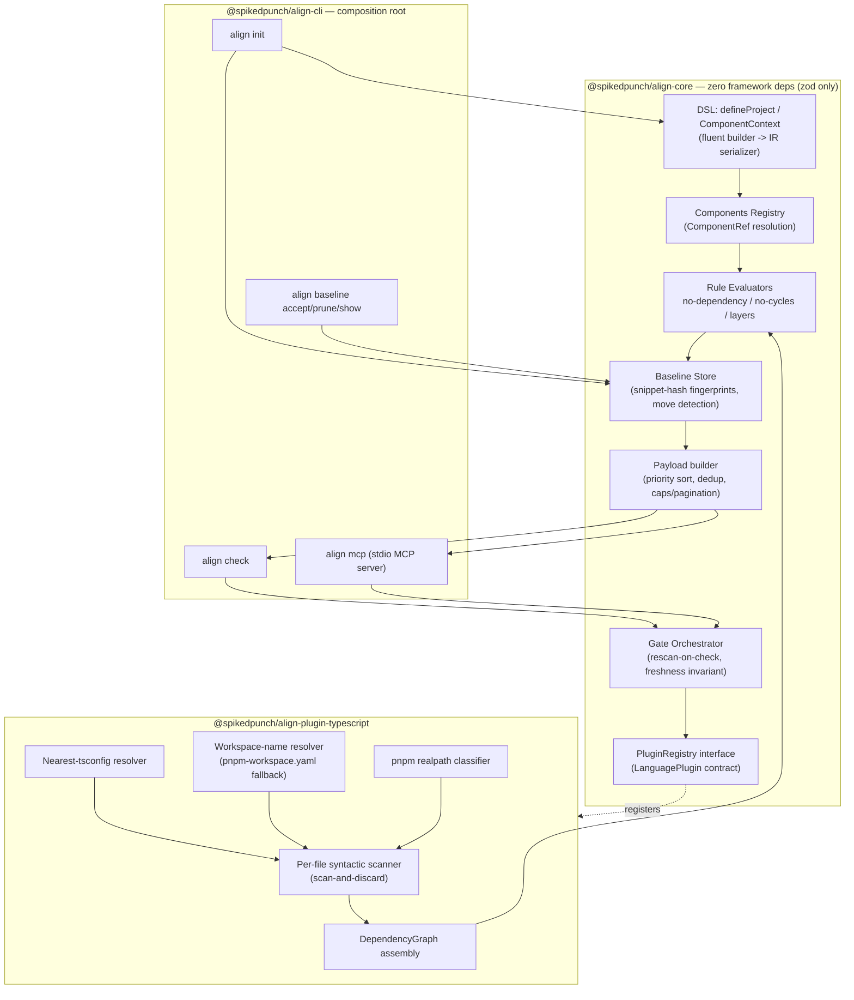

# align — Architecture (v1 + growth path)

Status: proposed for sign-off (Stage 0). Companion documents: `docs/adr/` (twelve ADRs), `docs/ir-schema.md`,
`docs/core-interfaces.md`. Evidence source: `docs/evidence/kluster-spike/SPIKE_REPORT.md`. Plan source: `IMPLEMENTATION_PLAN.md`.

## 1. Purpose & product thesis

align is a **verification oracle** for LLM coding agents, not a linter and not a survey tool. An agent
proposes a change; align answers one question deterministically — *does the code still conform to this
repo's declared architecture?* — and returns a payload the agent can act on without re-reading the whole
repo.

Three theses, each backed by spike evidence, drive every downstream decision:

1. **LLMs judge; deterministic tools execute and verify.** The agent decides *what* a fix should be; align
   decides *whether* the result conforms. Mixing these (an LLM "eyeballing" conformance, or a tool
   attempting to guess intent) reintroduces the failure mode align exists to remove.
2. **Token economy is not an optimization, it is the product.** A payload's job is to be actionable in the
   fewest tokens a loop can spend, every iteration. Structured-fields-only payloads measured **51
   tokens/violation vs. 182 tokens/violation with prose** (spike probe 5c) — the token budget *is* the UX.
3. **Trust in a verdict is binary and does not degrade gracefully.** Probe 2 demonstrated this directly: a
   single stale violation report from a scan-once cache caused the connected agent to conclude the tool was
   "static/canned … not a real dependency-graph analyzer" and **permanently distrust it**, refusing to
   continue the loop. There is no such thing as a "mostly fresh" oracle — freshness is a hard invariant
   (ADR 005), not a performance knob.

**Why v1 is architecture-first, not tool-wrapping-first.** The original plan wrapped prettier/eslint/tsc
behind adapters from day one. The spike's live discovery test (probe 1) showed a connected agent asked "are
there architectural problems here?" made **zero align calls** — it used the MCP server its own CLAUDE.md
mandated and ran a 5-subagent, ~363K-token manual survey instead. That survey found a planted import but
**missed both real dependency cycles** align found in 2.3 s / <900 tokens; conversely align cannot see the
survey's DI violations or `as any` casts. The lesson is not "agents don't need MCP tools" — it's that
**agents already run format/lint/type tools natively via bash**, and wrapping tools they already invoke
correctly adds no discovery-critical value, while architecture conformance (cycles, layering, dependency
direction) is invisible to bash-native tooling and is exactly what a 363K-token manual survey missed. v1
therefore ships the deterministic architecture engine only; the tool-wrapping gate stack (format/lint/types/
security/tests) remains fully designed in `IMPLEMENTATION_PLAN.md` as the growth path, activated when a
later stage's evidence demands it — nothing is deleted, only sequenced (see ADR 001).

## 2. Component diagram (v1)



Everything under `Core` compiles with zero dependency on `Plugin` — core defines interfaces
(`Scanner`, `LanguagePlugin`, `PluginRegistry`); `plugin-typescript` implements them. `cli` is the only
package that imports both and wires them together (§5).

## 3. Data flow — one `align_check` call

1. **Trigger**: `align check` (CLI) or the `align_check` MCP tool fires — no arguments select a subset in
   v1; every check is a full-repo check (ADR 005 — no impact-scoping until promoted).
2. **Fresh scan**: the orchestrator calls the registered `LanguagePlugin`'s `Scanner`, which walks every
   source file, parses it, extracts edges, and **discards the AST** immediately (scan-and-discard). Spike
   measured **2.16–2.33 s cold / 1.37 s mean warm on 456K LOC (1,755 files)**, and **12.9 s / 231 MB peak on
   3.23M LOC (17,708 files, n8n)** — no incremental machinery runs in v1 (ADR 005).
3. **Graph assembly**: nodes (file, component, LOC, exports) and edges (`import | reexport | dynamic |
   type-only`) are classified — inter-package edges resolved by **realpath**, not path-substring checks
   (ADR 004; spike: substring classification silently dropped **898 edges, ~11% of the graph**), with a
   **workspace-name resolver fallback** for uninstalled workspace packages (ADR 004; n8n: 54% of
   "uncertainty" was this).
4. **Rule evaluation**: each `RuleIR` in the loaded `RulesetIR` runs through its pure `RuleEvaluator` against
   the graph and the components registry. `arch.no-cycles` runs Tarjan SCC excluding `type-only` edges by
   default (probe 5a: including them adds only 2 benign type-reference loops).
5. **Violations produced**: the unified `Violation` model (ADR 002/`core-interfaces.md`) — structured fields
   only, `snippet` and per-edge cycle detail included at production time, not synthesized later.
6. **Baseline filter**: each violation's snippet-hash fingerprint is checked against `BaselineStore`; matches
   move to `baselinedCount` (a number); everything else is `red`. n8n's untouched repo surfaced **207 real
   runtime cycles** — without this step, day one on a mature repo is a wall of red (ADR 006).
7. **Payload assembly**: priority sort (architecture > security > types > lint > format — v1 populates only
   `architecture`), structural dedup that never removes per-instance targeting data, caps + pagination
   (ADR 007; spike: structured-only cut 200 violations from 36.8K to **10.2K tokens**).
8. **Surface**: CLI prints exit code + `--json`; MCP returns the same structured payload. Passing gates never
   emit violation text — counts only.

## 4. The v1 boundary

| Mechanism | v1 | Later-stage | Design Reserve |
|---|---|---|---|
| Core Violation/RuleIR/zod contract, orchestrator, gate model (`parse`, `architecture`, `security`) | ✅ | | |
| DSL (`defineProject`/`ComponentContext`, negation-free vocabulary, `.because()`, layer macros) | ✅ | | |
| Components registry (path-prefix primary, package-name complement, `ComponentRef`) | ✅ | | |
| TS/JS scanner: scan-and-discard, pnpm realpath, workspace-name fallback, type-only edges, nearest-tsconfig, package-entry→source mapping | ✅ | | |
| `arch.no-dependency` / `no-cycles` / `layers` engine, per-edge cycle detail | ✅ | | |
| `arch.metric` (max-LOC only) — promoted 2026-07-12 on kluster ruleset evidence | ✅ | | |
| `security` gate: `security.manifest.source-hygiene` + `security.manifest.new-dependency` — promoted 2026-07-12 on `docs/evidence/manifest-security-probe/MANIFEST_PROBE_REPORT.md` probe evidence (ADR 013); manifest scan domain lives in `plugin-typescript`, `dependsOn: []` always-run | ✅ | | |
| Baseline store (+move detection, `--rule`) | ✅ | | |
| MCP server (`align_check/status/violations/explain_rule`), CLI (`init/check/baseline`) | ✅ | | |
| Token-economy payload rules (structured-only, priority sort, dedup, caps/pagination) | ✅ | | |
| `align init` CLAUDE.md/AGENTS.md instructions block | ✅ | | |
| Gate `error` semantics + `dependsOn` metadata (v1 dependencies: architecture needs parse; security is `dependsOn: []`) | ✅ | | |
| Tool-wrapping gates: format/lint/types/tests, `security.secrets`, `security.tool` | | Stage 1/3 | |
| Install-script-exposure manifest rule (`docs/evidence/manifest-security-probe/MANIFEST_PROBE_REPORT.md` Rule 2) | | Stage 1/3 — after a content-pattern classifier rework (ADR 013 follow-up ladder) | |
| `align_fix_hints`/`align_autofix` MCP tools | | Stage 3/4 | |
| Edit-block apply pipeline / `FixProposal` (exact + `nearLine` match) | | Stage 4 (contract fixed now, ADR 010) | |
| `align build` doc→ruleset pipeline, lockfile, provenance | | Stage 4 (contract fixed now, ADR 011) | |
| Rule-conflict masking + oscillation detection | | Stage 3/4 (precedence fixed now, ADR 012) | |
| BYOK agent loop | | Stage 4 | |
| `arch.naming` rule kind; `arch.metric`'s fan-in/fan-out/instability metrics | | | Reserve — `arch.naming` demoted at sign-off review (not spike-exercised); `arch.metric`'s `loc` metric was promoted to v1 above (2026-07-12), these three metrics were not and still carry the promotion-on-evidence burden — reserved discriminants in `docs/ir-schema.md` |
| Six-component content-hash cache + impact-scoped re-verification (CIA) | | | Reserve — promotion trigger ~10s/check (plan §Design Reserve) |
| Plugin sessions (in-memory AST updates) | | | Reserve — same evidence |
| Conservative Graph Mode ≥80%-of-edges heuristic | | | Reserve — no firing evidence at n=2 |
| Whitespace-normalized fallback ladder (`fuzzy-apply`) | | | Reserve — start exact+`nearLine` only |
| Learned conflict store (`.align/conflicts.json`) | | | Reserve |
| `align doctor`, predictive cache diagnostics | | | Reserve |
| `baseline accept --since <commit>` | | | Reserve — `--rule` may suffice |
| `--auto-merge` terminal mode | | | Reserve — `--pr` default may be the only mode used |
| Stage 5 DX backlog (playground, wizard, VS Code ext, `align watch`) | | | Reserve |

Full detail for every later-stage/reserve row lives in `IMPLEMENTATION_PLAN.md` (Stage text and the
"Design Reserve" section) — this table is a pointer, not a re-specification.

## 5. Package layout for v1

```
packages/
├── core/               # @spikedpunch/align-core — DSL + IR (zod) + engine + baseline + PluginRegistry interfaces.
│                       #   Zero framework dependencies (zod only, per locked decision).
├── plugin-typescript/  # @spikedpunch/align-plugin-typescript — TS compiler API scanner, tsconfig/workspace resolution,
│                       #   + the manifest scan domain (package.json/pnpm-lock.yaml, ADR 013).
└── cli/                # @spikedpunch/align-cli — composition root: commander CLI + `align mcp` (stdio MCP server).
```

**Three packages, not five.** `@spikedpunch/align-agent` (Stage 4) and a standalone `@spikedpunch/align-docs` (rules-build, Stage 4)
are not created until their stage starts — an empty package is not a design decision, it's clutter.

**`@spikedpunch/align-dsl` is folded into `@spikedpunch/align-core` for v1 — judgment call, flagged for review.** The plan's
long-term layout gives the fluent builder its own package. In v1 the builder is a thin, framework-free layer
that immediately serializes to the IR `@spikedpunch/align-core` already owns; splitting it out today buys isolation
nobody consumes yet (there is exactly one caller: `align.config.ts`, loaded by the CLI) at the cost of a
second `package.json`, a second build target, and a cross-package type import for every DSL type used inside
core's own tests. Per the coding-standards "rule of three" (`CODING_BEST_PRACTICES.md` §25): duplication and
premature splitting are both smells, and a package boundary with a single consumer is the packaging
equivalent of premature abstraction. Extraction to `@spikedpunch/align-dsl` is cheap and fully reversible — it becomes
justified the moment a second consumer needs the builder without the engine (e.g., IDE tooling that
type-checks `align.config.ts` without pulling in rule evaluators, or the Stage 5 `align playground`). Until
then it stays inside `@spikedpunch/align-core` as a clearly-bounded internal module (`@spikedpunch/align-core/dsl`), still exported,
still tested in isolation. `@spikedpunch/align-plugin-typescript` is **not** folded in: it depends on the `typescript`
package, and core's "zero framework dependencies (zod only)" invariant is the thing that keeps core
importable by a future non-Node/non-TS consumer without dragging a compiler along — that boundary is worth
the extra package from day one.

**Dependency direction**: `core ← plugin-typescript` (plugin implements core's interfaces, never the
reverse); `cli → {core, plugin-typescript}`. Core never imports downstream — enforced by align's own
`arch.no-dependency` rules against its own repo starting Stage 2, per the plan's dogfooding commitment.

**Composition root**: `@spikedpunch/align-cli` is the only package that imports a concrete `LanguagePlugin` (or
`ManifestScanner`) and registers it. The orchestrator (in core) is constructed with a
`PluginRegistry` and, as of ADR 013, a `ManifestScanner`; core never imports `plugin-typescript`
directly:

```ts
// @spikedpunch/align-core — interfaces only
interface PluginRegistry {
  getPluginForFile(file: RepoRelativePath): LanguagePlugin | undefined;
  getAllPlugins(): readonly LanguagePlugin[];
}
interface ManifestScanner {
  scan(options: ManifestScanOptions): Promise<ManifestInventory> | ManifestInventory;
}

// @spikedpunch/align-cli — composition root
import { NodeManifestScanner, TypeScriptPlugin } from '@spikedpunch/align-plugin-typescript';
const registry: PluginRegistry = new StaticPluginRegistry([new TypeScriptPlugin()]);
const manifestScanner: ManifestScanner = new NodeManifestScanner();
const orchestrator = new GateOrchestrator(registry, /* rulesetIR, baselineStore, hostPredicates */ undefined, manifestScanner);
```

**Manifest scan domain placement (ADR 013)**: `plugin-typescript`, not core, and not a new
`plugin-manifest` package. The probe that motivated this (`docs/evidence/manifest-security-probe/MANIFEST_PROBE_REPORT.md`) flagged
this as a genuine open question — manifest/lockfile text is a different input class from
`plugin-typescript`'s TS-compiler-API source scanning. It stays inside `plugin-typescript` rather
than becoming a fourth package because it is Node/pnpm-ecosystem-specific (same "zero framework
dependencies" argument that keeps `plugin-typescript` itself separate from core, ADR 001/004's
boundary) and because it reuses `workspace.ts`'s existing `loadWorkspacePackages` — splitting it out
would either duplicate that inventory logic or force a cross-package dependency for one shared
helper, the same "packaging equivalent of premature abstraction" judgment call this section already
makes for `@spikedpunch/align-dsl` above. Core only owns the `ManifestScanner` injection interface and the pure
manifest-based evaluators (`rules/manifest-evaluators.ts`) — same shape as the `Scanner`/
`LanguagePlugin` split one paragraph up.

**Scoped to what v1 actually needs, given there is one language**: `StaticPluginRegistry` in v1 is a
one-element list with no file-match conflict resolution, no priority ordering between plugins, and no
merge-graph logic across plugins — those are real problems only a second `LanguagePlugin` creates. The
interface is written generically (`getAllPlugins()` returns an array) so a second plugin is an additive
change at the CLI composition root, not an interface rewrite; the registry's *implementation* stays as
simple as one language warrants.

## 6. Honest limitations

- **align verifies architecture, not behavior.** A fix that satisfies every `arch.*` rule can still be
  wrong — the cleanest way to remove a forbidden import is sometimes deleting the feature that needed it.
  v1 has no behavioral gate at all (the tests gate is Stage 3+); the plan's behavioral-preservation guards
  (exported-symbol diffing, coverage refusal) are agent-loop mechanisms (Stage 4) that don't exist yet.
  **Green from align means "conforms to the declared architecture," never "correct."**
- **Green ≠ correct is bounded by whatever tests the target repo already has**, once the tests gate and
  agent loop exist — align does not invent test coverage, and v1 doesn't even reach that stage.
- **The oracle has no memory of intent beyond the DSL.** If `align.config.ts` doesn't encode a rule, align
  is silent on it — the 363K-token manual survey in probe 1 found DI violations and `as any` casts that no
  v1 rule kind expresses. align is a deterministic, repeatable loop anchor for the rules it *does* encode,
  not a replacement for broader review.
- **Freshness is guaranteed only for what the scanner sees.** A fresh scan is real per ADR 005; scan
  boundaries (excludes, uncertain files under Conservative Graph Mode) are still config-time human
  judgment, not machine-verified — a badly configured exclude can hide real edges as reliably as a stale
  cache, just without the false confidence of a "green" from stale state.
